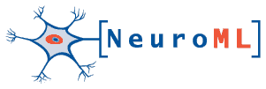

# NeuroML

 

The NeuroML project focuses on the development of an XML based description language that provides a common data format for defining and exchanging descriptions of neuronal cell and network models.

## Normative definitions
[NeuroML version 2](http://www.neuroml.org/neuromlv2) is currently under active development. There is an [XSD Schema](http://github.com/NeuroML/NeuroML2/blob/master/Schemas/NeuroML2/NeuroML_v2beta3.xsd) for validating the structure of NeuroML2 documents, and documentation on the elements can be found [here](http://www.neuroml.org/NeuroML2CoreTypes/Cells.html).

The LEMS (Low Entropy Model Specification) language is used to define the structure of NeuroML2, and the language is described by an [XSD Schema](http://github.com/LEMS/LEMS/blob/master/Schemas/LEMS/LEMS_v0.7.1.xsd) and [this documentation](http://lems.github.io/LEMS/elements.html).

[Cannon et al. Frontiers in Neuroinformatics 2014](http://journal.frontiersin.org/Journal/10.3389/fninf.2014.00079/abstract) describes in more detail the relationship between LEMS and NeuroML 2.

NeuroML version 1 consisted of a set of related languages (MorphML, ChannelML, NetworkML) for defining the components of neuronal cell and network models. See [here](file:///https%3A/%252Fwww.neuroml.org/specifications) and [Gleeson et al. 2010](http://www.ploscompbiol.org/article/info%3Adoi%2F10.1371%2Fjournal.pcbi.1000815).

## Governance
NeuroML is developed by an elected [editorial board](http://www.neuroml.org/editors).

## Communication
The main mailing list for discussions on NeuroML is [neuroml-technology@lists.sourceforge.net](http://lists.sourceforge.net/lists/listinfo/neuroml-technology).

## Software support
A list of the latest software tools, databases etc. supporting NeuroML can be found [here](http://www.neuroml.org/tool_support).

## Contact
Various ways of getting in contact with the NeuroML community are listed [here](http://www.neuroml.org/getneuroml).

## How to cite NeuroML
Robert C. Cannon, Padraig Gleeson, Sharon Crook, Gautham Ganapathy, Boris Marin, Eugenio Piasini and R. Angus Silver, LEMS: A language for expressing complex biological models in concise and hierarchical form and its use in underpinning NeuroML 2, Frontiers in Neuroinformatics 2014, doi: [10.3389/fninf.2014.00079](http://journal.frontiersin.org/Journal/10.3389/fninf.2014.00079/abstract)

## History
The concept of NeuroML was first introduced in an article by Goddard et al. (2001), following meetings at the University of Edinburgh where initial templates for the model description language structures were discussed. The proposal extended general purpose structures for neuroscience data proposed by Gardner et al. (2001).

At that time, the design principles for NeuroML were closely linked with a specific software architecture in which a base application loads a range of plugins to handle different aspects of a simulation experiment. The simulation platform Neosim provided an implementation of this approach (Howell et al. 2003), and early NeuroML development was closely aligned to this architecture. Fred Howell and Robert Cannon developed a software library, the NeuroML Development Kit (NDK), to simplify the process of working with XML serializations of models. This library implemented a particular dialect of XML but did not define particular structures at the model description level. Instead, Neosim plugin developers were free to develop their own structures and serialize them via the NDK, in the hope that some consensus would emerge around the most useful ones. In practice, few developers beyond the Edinburgh group developed or used such structures and the resulting XML was too application specific to gain wider adoption. The Neosim project was completed in 2005.

Based on discussions with Howell and Cannon about the need to develop a consensus for describing widely used model components, Sharon Crook worked with the neuroanatomy community on a language for describing neuronal morphologies in XML, MorphML (Qi and Crook 2004). At the same time, Padraig Gleeson working with Angus Silver was developing neuroConstruct, for generating neuronal simulations for the NEURON and GENESIS simulators (Gleeson et al. 2007), which had its own internal simulator independent representation for morphologies, channel and networks. It was agreed that these efforts should be merged under the banner of NeuroML, and the v1.x structure of NeuroMLwas created. A modular approach containing MorphML, ChannelML and NetworkML was adopted to allow application developers to support only those parts of the language needed by their application (Crook et al. 2007, Gleeson et al. 2010). XML schema files for this version of the standard have been available since 2006. The motivation, structure and functionality of this version is described in Gleeson et al. 2010, while the specification of the language is outlined in the Supporting Information of that publication.

NeuroML v2.0 has been under development since 2011. The main motivation for v2.0 was the lack of extensibility of NeuroML v1.x; every new model type which was introduced into the language required an update to the Schema, updates to the text documentation and an implementation in each of the native formats of the target simulators. NeuroML v2.0 is built on the LEMS (Low Entropy Model Specification) language, which allows machine readable definitions of the cell, channel and synapse models which form the core of the language. This increases transparency of model structure and dynamics and facilitates automatic mapping of the models to multiple simulation formats. More details on the structure of LEMS and how it is used in NeuroML v2.0 can be found in Cannon et al. 2014. In parallel with development of NeuroML v2.0 and LEMS, software libraries for reading, writing and running simulations using the languages are under active development in [Java and Python](http://www.neuroml.org/getneuroml).