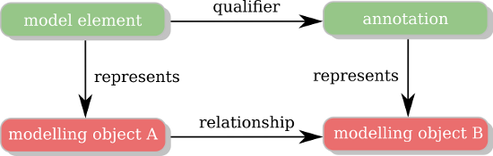
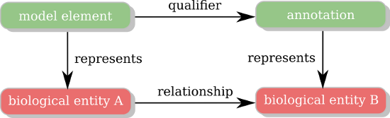

# BioModels.net Qualifiers
Identifier for this specification is: https://identifiers.org/combine.specifications:qualifiers-1.1

All specifications are available from https://identifiers.org/combine.specifications:qualifiers

The qualification of an annotation is important to grasp the relation between a model component and the resource used to annotate it. The relationship is rarely one-to-one, and the information content of an annotation is greatly increased if one knows what it represents rather than to knowing only that it is "related to".

There are two kinds of qualifiers used for different purposes:

1. In the refinement of the relationship between an annotation resource and the modelling concept represented by a model element
2. In the refinement of the relationship between an annotation resource and the biological object represented by a model element

One can view the annotation of a model component as a statement in the form of a 'triple'. The resource used in the annotation is the 'object', while the qualifier is the 'predicate'. In the cases of the model qualifiers, the 'subject' of the relation is the modelling concept represented by the model component referenced by the annotation. The modelling concept may be the model itself, a mathematical construct, or a hypothesis that is proposed, changing the way we previously understood the model, etc. In the cases of the biology qualifiers, the 'subject' of the relation is the biological or biochemical object represented by the enclosing model element.

In the following, the qualifiers of the first type are called **model qualifiers**. The associated namespace that should be used is 'http://biomodels.net/model-qualifiers/'. The qualifiers of the second type are called **biology qualifiers**. The associated namespace that should be used is 'http://biomodels.net/biology-qualifiers/'.

## model qualifiers
These kinds of qualifiers define the relationship between a modelling object and its annotation:



Model Qualifiers relating a modelling object and its annotation

The following is the list of the current qualifiers in the 'http://biomodels.net/model-qualifiers/' namespace. This list may grow but no element will be removed.

### is
The modelling object represented by the model element is identical with the subject of the referenced resource (modelling object B). For instance, this qualifier might be used to link an encoded model to a database of models.

### isDerivedFrom
The modelling object represented by the model element is derived from the modelling object represented by the referenced resource (modelling object B). This relation may be used, for instance, to express a refinement or adaptation in usage for a previously described modelling component.

### isDescribedBy
The modelling object represented by the model element is described by the subject of the referenced resource (modelling object B). This relation might be used to link a model or a kinetic law to the literature that describes it.

### isInstanceOf
The modelling object represented by the model element is an instance of the subject of the referenced resource (modelling object B). For instance, this qualifier might be used to link a specific model with its generic form.

### hasInstance
The modelling object represented by the model element has for instance (is a class of) the subject of the referenced resource (modelling object B). For instance, this qualifier might be used to link a generic model with its specific forms.


## biology qualifiers
These kind of qualifiers define the relationship between a biological object represented by a model element and its annotation:


Biology Qualifiers relating a biological object and its annotation

The following is the list of the current qualifiers in the 'http://biomodels.net/biology-qualifiers/' namespace. This list may grow but no element will be removed.

### is
The biological entity represented by the model element has identity with the subject of the referenced resource (biological entity B). This relation might be used to link a reaction to its exact counterpart in a database, for instance.

### hasVersion
The biological entity represented by the model element is a more general version of the subject of the referenced resource (biological entity B). For example, this relation may be used to connect a generic form of a protein in a model to a species-specific version in Uniprot.

### isVersionOf
The biological entity represented by the model element is a more specific version or an instance of the subject of the referenced resource (biological entity B). This relation may be used to connect, for example, a specific process in the model to a generic process name in the Gene Ontology.

### isDescribedBy
The biological entity represented by the model element is described by the subject of the referenced resource (biological entity B). This relation should be used, for instance, to link a species or a parameter to the literature that describes the concentration of that species or the value of that parameter.

### hasPart
The biological entity represented by the model element includes the subject of the referenced resource (biological entity B), either physically or logically. This relation might be used to link a complex to the description of its components.

### isPartOf
The biological entity represented by the model element is a physical or logical part of the subject of the referenced resource (biological entity B). This relation may be used to link a model component to a description of the complex in which it is a part.

### hasProperty
The subject of the referenced resource (biological entity B) is a property of the biological entity represented by the model element. This relation might be used when a biological entity exhibits a certain enzymatic activity or exerts a specific function.

### isPropertyOf
The biological entity represented by the model element is a property of the referenced resource (biological entity B).

### encodes
The biological entity represented by the model element encodes, directly or transitively, the subject of the referenced resource (biological entity B). This relation may be used to express, for example, that a specific DNA sequence encodes a particular protein.

### isEncodedBy
The biological entity represented by the model element is encoded, directly or transitively, by the subject of the referenced resource (biological entity B). This relation may be used to express, for example, that a protein is encoded by a specific DNA sequence.

### isHomologTo
The biological entity represented by the model element is homologous to the subject of the referenced resource (biological entity B). This relation can be used to represent biological entities that share a common ancestor.

### occursIn
The biological entity represented by the model element is physically limited to a location, which is the subject of the referenced resource (biological entity B). This relation may be used to ascribe a compartmental location, within which a reaction takes place.

### hasTaxon
The biological entity represented by the model element is taxonomically restricted, where the restriction is the subject of the referenced resource (biological entity B). This relation may be used to ascribe a species restriction to a biochemical reaction.

### hasSource
The biological process (e.g., a reaction) has inputs (sources) as listed by the referenced resource. For reactions, these are the reactants. 

### hasSink
The biological process (e.g., a reaction) has outputs (sinks) as listed by the referenced resource. For reactions, these are the products.

### hasMediator
The biological process (e.g., a reaction) has mediators (e.g., enzymes) as listed by the reference resource. Mediators can inhibit as well as enable or enhance a reaction. 

### hasMultiplier
An attribute of the link between an entity and a process, that indicates the stoichiometry of that relationship. For example, a "source" of a reaction may need three copies of some participant; thus, hasMultiplier would be three. To use this qualifier, one must reify (make a separate object) the "hasSource" or "hasSink" link.

### hasPhysicalEntity
An attribute of the link between an entity and a process. "hasPhysicalEntity" connects this participation link to the physical entity description of the participant. To use this qualifier, one must have a reified link.

### `deprecated` isRelatedTo
The biological entity represented by the model element is somehow associated, directly or transitively, with the subject of the referenced resource (biological entity B). This qualifier may be used as a generic way to express any biological relationship.


## Qualifier Usage
Here is an example of the kind of annotation (using RDF) one could add to a model element representing a complex between two proteins:

```{xml}
<rdf:RDF xmlns:rdf="http://www.w3.org/1999/02/22-rdf-syntax-ns#"
        xmlns:bqbiol="http://biomodels.net/biology-qualifiers/">
  <rdf:Description rdf:about="#MyModelElement">
    <bqbiol:hasPart>
      <rdf:Bag>
        <rdf:li rdf:resource="https://identifiers.org/uniprot/P04551" />
        <rdf:li rdf:resource="https://identifiers.org/uniprot/P10815" />
       </rdf:Bag>
    </bqbiol:hasPart>
  </rdf:Description>
</rdf:RDF>
```

Here is an example of the kind of annotation (using RDF) one could add to a model in order to describe its BioModels Database perennial identifier and its reference publication:

```{xml}
<rdf:RDF xmlns:rdf="http://www.w3.org/1999/02/22-rdf-syntax-ns#"
        xmlns:bqmodel="http://biomodels.net/model-qualifiers/">
  <rdf:Description rdf:about="#_000001">
    <bqmodel:is>
       <rdf:Bag>
        <rdf:li rdf:resource="https://identifiers.org/biomodels.db/BIOMD0000000004" />
       </rdf:Bag>
    </bqmodel:is>
    <bqmodel:isDescribedBy>
       <rdf:Bag>
        <rdf:li rdf:resource="https://identifiers.org/pubmed/1833774" />
       </rdf:Bag>
    </bqmodel:isDescribedBy>
  </rdf:Description>
</rdf:RDF>
```
