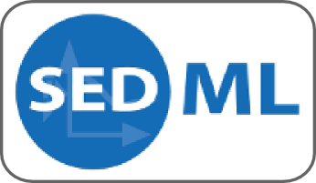

# Simulation Experiment Description Markup Language

The [Simulation Experiment Description Markup Language (SED-ML)](https://sed-ml.org/) is an XML-based format for encoding simulation experiments. SED-ML allows to define the models to use, the experimental tasks to run and which results to produce.

## Normative definitions
SED-ML is defined in a specification document that describes the elements of the language, its syntax, and provides validation rules.

The latest specification is [SED-ML Level 1 Version 4](https://identifiers.org/combine.specifications:sed-ml.level-1.version-4).
 
All specifications are
* [SED-ML Level 1 Version 4](https://identifiers.org/combine.specifications:sed-ml.level-1.version-4)
* [SED-ML Level 1 Version 3](https://identifiers.org/combine.specifications:sed-ml.level-1.version-3)
* [SED-ML Level 1 Version 2](https://identifiers.org/combine.specifications:sed-ml.level-1.version-2)
* [SED-ML Level 1 Version 1](https://identifiers.org/combine.specifications:sed-ml.level-1.version-1)

## Governance
SED-ML development is coordinated by an [editorial board](https://sed-ml.org/about.html) elected by the community.

## Communication
SED-ML development is discussed on the mailing list [sed-ml-discuss@googlegroups.com](https://groups.google.com/d/forum/sed-ml-discuss).

## Software support
Several [software tools](http://sed-ml.org/showcase.html) support SED-ML. Implementation of support is facilitated by a number of APIs.

## Contact
For information about SED-ML itself, contact [sed-ml-discuss@googlegroups.com](https://groups.google.com/d/forum/sed-ml-discuss). For information about SED-ML development and governance, contact [sed-ml-editors@googlegroups.com](mailto:sed-ml-editors@googlegroups.com). More information can be found on the SED-ML website: [https://sed-ml.org](https://sed-ml.org)

## How to cite SED-ML
Waltemath D., Adams R., Bergmann F.T., Hucka M., Kolpakov F., Miller A.K., Moraru I.I., Nickerson D., Sahle S., Snoep J.L., Le Novère N. Reproducible computational biology experiments with SED-ML -- The Simulation Experiment Description Markup Language. BMC Systems Biology (2011), 5:198. https://identifiers.org/pubmed/22172142

Smith LP, Bergmann FT, Garny A, Helikar T, Karr J, Nickerson D, Sauro H, Waltemath D, König M. The simulation experiment description markup language (SED-ML): language specification for level 1 version 4. J Integr Bioinform. 2021 Oct 5;18(3):20210021. doi: [10.1515/jib-2021-0021](https://doi.org/10.1515/jib-2021-0021). PMID: https://identifiers.org/pubmed/35330701; PMCID: PMC8560344.

## History
The idea of developing a standard format for simulation experiment encoding was born at the European Bioinformatics Institute. In 2007, Dagmar Waltemath and Nicolas Le Novere started to draft such a format during Dagmar's Marie-Curie funded internship in the Compneur group.

The SED-ML project was first presented publicly at the 12^th SBML Forum Meeting in 2007, in Long Beach (US). The first version of SED-ML was then presented at the "Super-hackathon "standards and ontologies for Systems Biology"" in Okinawa in 2008. Back then, the language was called MIASE-ML. In Okinawa, many researchers showed a high interest in the format, and discussions were vital. MIASE became the Minimum Information guideline for simulation experiments. MIASE-ML was renamed into "Simulation Experiment Description Markup Language" (SED-ML).

Level 1 Version 1 of SED-ML officially appeared in March 2011, but SED-ML was presented, discussed and further specified during several community meetings in the years in between, including the combined "CellML-SBGN-SBO-BioPAX-MIASE workshop" in 2009, or the "2010 SBML-BioModels.net Hackathon".

Level 1 Version 2 of SED-ML was officially released on December 2, 2013 after two years of ratification by the community.

Since then SED-ML has been developed in collaboration with the communities forming the "computational modeling in biology network" (COMBINE). Besides dedicated sessions at various meetings, the development of SED-ML benefits from community interactions on the sed-ml-discuss mailing list ([sed-ml-discuss@googlegroups.com](https://groups.google.com/d/forum/sed-ml-discuss)).
